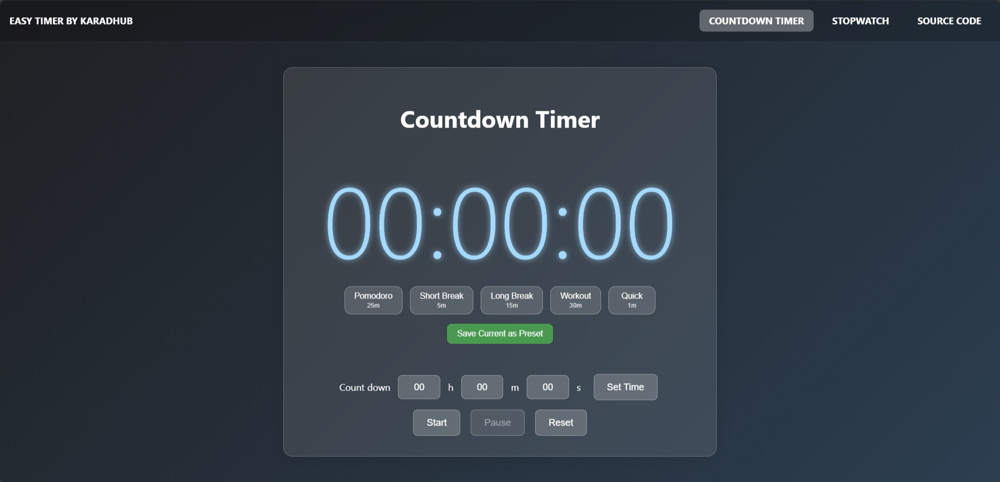

# Easy Timer

A modern, ad-free web-based timer application with a beautiful glassmorphism design. Easy Timer provides both countdown timer and stopwatch functionality with an intuitive, responsive interface that works seamlessly across all devices.




## ✨ Features

### 🕐 Countdown Timer

-   **Precision Timing**: Accurate countdown with visual and color feedback
-   **Quick Presets**: One-click access to common timer durations:
    -   🍅 Pomodoro (25 minutes) - Perfect for focused work sessions
    -   ☕ Short Break (5 minutes) - Quick breaks between tasks
    -   🛋️ Long Break (15 minutes) - Extended rest periods
    -   💪 Workout (30 minutes) - Exercise sessions
    -   ⚡ Quick Timer (1 minute) - Fast timing needs
-   **Custom Presets**: Save your frequently used timer durations
    -   Create personalized presets with custom names
    -   Persistent storage across browser sessions
    -   Easy management with delete functionality
-   **Manual Time Setting**: Flexible input for hours, minutes, and seconds
-   **Visual Feedback**: Color-coded timer display (blue → yellow → red as time expires)
-   **Smart Controls**: Start, pause, and reset functionality with intuitive button states

### ⏱️ Stopwatch

-   **Precise Timing**: Millisecond accuracy for precise time measurement
-   **Clean Interface**: Large, easy-to-read display (MM:SS,MS format)
-   **Full Control**: Start, stop, and reset functionality
-   **Background Operation**: Continues running when switching between timer modes

### 🎨 Modern Design

-   **Glassmorphism UI**: Beautiful frosted glass effect with subtle transparency
-   **Responsive Layout**: Seamless experience across desktop, tablet, and mobile devices
-   **Mobile-First**: Optimized touch controls and hamburger menu for mobile users
-   **Dark Theme**: Easy on the eyes with elegant gradient backgrounds
-   **Smooth Animations**: Polished interactions with hover effects and transitions

### 🔧 Technical Features

-   **Single Page Application**: Fast navigation between timer modes without page reloads
-   **Local Storage**: Automatic saving of custom presets
-   **Cross-Browser Compatible**: Works on all modern browsers
-   **No Dependencies**: Pure HTML, CSS, and JavaScript - no external libraries
-   **Offline Ready**: Can be used without an internet connection once loaded
-   **Ad-Free**: Clean, distraction-free experience

## 🚀 How to Run

### Option 1: Direct Usage

1. Simply open `index.html` in any modern web browser
2. The application will load instantly and be ready to use

### Option 2: Local Development Server

For development or if you prefer running through a server:

```bash
# Using Python 3
python -m http.server 8000

# Using Python 2
python -S SimpleHTTPServer 8000

# Using Node.js (if you have http-server installed)
npx http-server

# Using PHP
php -S localhost:8000
```

Then open `http://localhost:8000` in your browser.

## 🌐 Deployment

### Deploy to Vercel (Recommended)

[](https://vercel.com/new/clone?repository-url=https://github.com/karadhub/easytimer)

**Quick Deploy via CLI:**

```bash
# Install Vercel CLI
npm i -g vercel

# Login to Vercel
vercel login

# Deploy (from project directory)
vercel --prod
```

**Or use the included scripts:**

```bash
# For Unix/Mac/WSL
chmod +x deploy.sh && ./deploy.sh

# For Windows PowerShell
.\deploy.ps1
```

### Other Deployment Options

Easy Timer is a static web application and can be deployed on any static hosting service:

-   **Netlify**: Drag and drop the project folder
-   **GitHub Pages**: Enable Pages in repository settings
-   **Firebase Hosting**: `firebase deploy`
-   **Surge.sh**: `surge` (install with `npm i -g surge`)

See `DEPLOYMENT.md` for detailed deployment instructions.

## 📱 How to Use

### Countdown Timer

1. **Quick Start with Presets**: Click any preset button (Pomodoro, Short Break, etc.) for instant setup
2. **Manual Setup**:
    - Enter hours, minutes, and seconds in the input fields
    - Click "Set Time" to confirm your duration
3. **Control the Timer**:
    - Click "Start" to begin countdown
    - Use "Pause" to temporarily stop (resume with "Start")
    - Click "Reset" to return to 00:00:00
4. **Custom Presets**:
    - Set up your desired time manually
    - Click "Save Current as Preset" and enter a name
    - Your preset will appear below for future use
    - Delete presets using the × button when no longer needed

### Stopwatch

1. Switch to stopwatch mode using the navigation menu
2. Click "Start" to begin timing
3. Use "Stop" to pause the stopwatch
4. Click "Reset" to return to 00:00,00

### Navigation

-   **Desktop**: Use the top navigation bar to switch between timer modes
-   **Mobile**: Tap the hamburger menu (☰) to access navigation options

## 🌟 Browser Support

Easy Timer works on all modern browsers including:

-   Chrome/Chromium (recommended)
-   Firefox
-   Safari
-   Edge
-   Mobile browsers (iOS Safari, Chrome Mobile, etc.)

## 📄 License

This project is open source. Check the license file for details.

## 🤝 Contributing

Contributions are welcome! Feel free to submit issues and enhancement requests.
